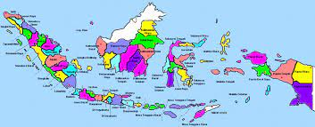
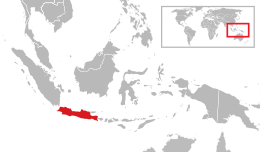
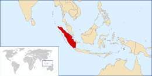
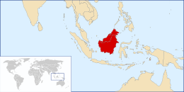
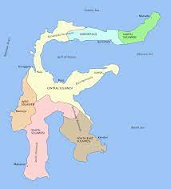
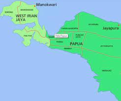

<html>
    

    
            <meta name="viewport" content="width=device-width, initial-scale=1">
            <link rel="stylesheet" href="w3.css">
        
    
            

                
            

            
            

                <button class="w3-bar-item w3-button" onclick="pulau('Home')" style="font-size: large;">Home</button>
                <button class="w3-bar-item w3-button" onclick="pulau('Jawa')" style="font-size: large;">Jawa</button>
                <button class="w3-bar-item w3-button" onclick="pulau('Sumatera')" style="font-size: large;">Sumatera</button>
                <button class="w3-bar-item w3-button" onclick="pulau('Kalimantan')" style="font-size: large;">Kalimantan</button>
                <button class="w3-bar-item w3-button" onclick="pulau('Sulawesi')" style="font-size: large;">Sulawesi</button>
                <button class="w3-bar-item w3-button" onclick="pulau('Papua')" style="font-size: large;">Papua</button>
            

            
            

                <h1>Home</h1>
                

                Berikut adalah nama-nama pulau besar beserta sedikit penjelasan nya.
                

                <h4>
                    Nama : Nuri Hanang Prasetyo  
                    Kelas : IF-3  
                    NIM : 10122091
                </h4>
            

            

                <h1>Pulau Jawa</h1>
                

                Jawa adalah sebuah pulau di Indonesia yang terletak di kepulauan Sunda Besar dan merupakan pulau terluas ke-13 di dunia. Jumlah penduduk di Pulau Jawa sekitar 150 juta. Pulau Jawa dihuni oleh 60% total populasi Indonesia. Angka ini menurun jika dibandingkan dengan sensus penduduk tahun 1905 yang mencapai 80,6% dari seluruh penduduk Indonesia. Penurunan penduduk di Pulau Jawa secara persentase diakibatkan perpindahan penduduk (transmigrasi) dari Pulau Jawa ke daerah lain di Indonesia.
                Ibu kota Indonesia adalah Jakarta dan terletak di Jawa bagian barat laut (tepatnya di ujung paling barat Jalur Pantura).
                 
                 
                
            

            

                <h1>Pulau Sumatera</h1>
                

                Sumatera adalah pulau keenam terbesar di dunia yang terletak di Indonesia, dengan luas 473.481 km². Penduduk pulau ini sekitar 57.940.351 (sensus 2018). Pulau ini dikenal pula dengan nama lain yaitu Pulau Percha, Andalas, atau Suwarnadwipa (bahasa Sanskerta, berarti "pulau emas"). Kemudian pada Prasasti Padang Roco tahun 1286 dipahatkan swarnnabhūmi (bahasa Sanskerta, berarti "tanah emas") dan bhūmi mālayu ("Tanah Melayu") untuk menyebut pulau ini.
                Selanjutnya dalam naskah Negarakertagama dari abad ke-14 juga kembali menyebut "Bumi Malayu" (Melayu) untuk pulau ini.
                 
                 
                
            

            

                <h1>Pulau Kalimantan</h1>
                

                Kalimantan atau bisa disebut dengan borneo atau juga disebut Borneo oleh dunia internasional. Kalimantan adalah pulau terbesar ketiga di dunia yang terletak di sebelah utara Pulau Jawa dan di sebelah barat Pulau Sulawesi. Pulau Kalimantan dibagi menjadi wilayah Indonesia (73%), Malaysia (26%), dan Brunei (1%).
                Pulau Kalimantan terkenal dengan julukan "Pulau Seribu Sungai" karena banyaknya sungai yang mengalir di pulau ini.
                 
                 
                
                

                

                    <h1>Pulau Sulawesi</h1>
                    

                    Sulawesi adalah sebuah pulau di Indonesia. Sulawesi merupakan salah satu dari empat Kepulauan Sunda Besar dan merupakan pulau terbesar kesebelas di dunia. Pulau Sulawesi terletak di sebelah timur Pulau Kalimantan, sebelah barat Kepulauan Maluku, dan sebelah selatan Mindanao dan Kepulauan Sulu, Filipina.
                    Di Indonesia, hanya Pulau Sumatra, Pulau Kalimantan, dan Papua yang lebih besar luas wilayahnya serta hanya Pulau Jawa, serta Pulau Sumatra yang memiliki populasi lebih banyak dari Sulawesi.
                     
                     
                    
                    

                    

                        <h1>Pulau Papua</h1>
                        

                        Papua aadalah pulau terbesar kedua (setelah Greenland) di dunia yang terletak di sebelah utara Australia. Pulau ini dibagi menjadi dua wilayah yang bagian baratnya merupakan wilayah Indonesia dan bagian timurnya merupakan negara Papua Nugini. Di pulau yang bentuknya menyerupai burung cendrawasih ini terletak gunung tertinggi di Indonesia,
                        yaitu Puncak Jaya (4.884 m). Untuk wilayah Indonesia, penduduk asli Papua disebut sebagai Orang Asli Papua, yang terdiri dari beragam suku bangsa tersebar di seluruh kabupaten dan kota.
                         
                         
                        
                        

            
    
        
    

</html>
